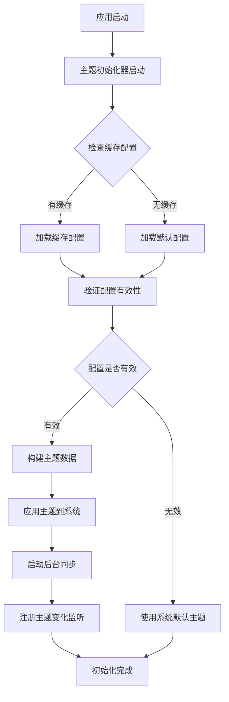

# 主题初始化配置使用指南

## 概述

本文档详细介绍了Flutter自建框架中主题初始化配置功能的设计和使用方法。该功能提供了完整的主题管理解决方案，支持动态主题切换、远程配置同步、品牌定制等高级特性。

## 核心特性

### 🎨 完整的主题管理系统
- **配置驱动**：通过JSON配置文件定义主题
- **动态加载**：支持本地和远程主题配置
- **缓存优化**：智能缓存机制提升性能
- **降级保护**：配置失败时自动使用默认主题

### 🔧 高度可扩展的架构
- **插件化设计**：支持自定义主题扩展
- **品牌定制**：完整的品牌主题定制支持
- **多环境支持**：开发、测试、生产环境配置

### 🚀 性能优化
- **内存缓存**：常用主题配置内存缓存
- **懒加载**：按需加载主题资源
- **异步初始化**：不阻塞应用启动

## 架构设计

### 核心组件

```
主题系统架构
├── ThemeInitializer (主题初始化器)
│   ├── 配置加载与验证
│   ├── 服务初始化
│   └── 降级处理
├── ThemeConfigManager (配置管理器)
│   ├── 本地配置管理
│   ├── 远程配置同步
│   └── 配置验证
├── ThemeCacheService (缓存服务)
│   ├── 内存缓存
│   ├── 持久化缓存
│   └── 缓存清理
└── ThemeService (主题服务)
    ├── 主题应用
    ├── 状态管理
    └── 事件监听
```

### 初始化流程



## 使用方法

### 1. 基础使用

主题系统已集成到应用初始化流程中，无需额外配置即可使用：

```dart
void main() async {
  WidgetsFlutterBinding.ensureInitialized();
  
  // 应用初始化（包含主题初始化）
  await AppInitializer.initialize();
  
  runApp(MyApp());
}
```

### 2. 自定义主题配置

#### 创建本地主题配置

```dart
// 创建自定义主题配置
final customTheme = ThemeConfigManager.instance.createCustomConfig(
  name: '我的主题',
  description: '个性化主题配置',
  primaryColor: Colors.purple,
  secondaryColor: Colors.orange,
  mode: AppThemeMode.light,
);

// 添加到配置管理器
await ThemeConfigManager.instance.addConfig(customTheme);

// 应用主题
await ThemeConfigManager.instance.setCurrentConfig(customTheme);
```

#### 从JSON导入主题

```dart
// 从JSON配置导入主题
final configJson = {
  "id": "custom_theme",
  "name": "自定义主题",
  // ... 其他配置
};

await ThemeConfigManager.instance.importConfig(configJson);
```

### 3. 远程主题配置

#### 配置远程主题URL

```dart
// 在应用初始化时配置远程主题URL
await ThemeConfigManager.instance.initialize(
  remoteConfigUrl: 'https://api.example.com/themes',
);

// 手动同步远程配置
await ThemeConfigManager.instance.syncRemoteConfigs();
```

#### 远程配置格式

参考 `example_theme_config.json` 文件，远程配置应返回以下格式：

```json
{
  "themes": [
    {
      "id": "theme_id",
      "name": "主题名称",
      "description": "主题描述",
      "version": "1.0.0",
      "mode": 2,
      "primaryColor": {
        "value": 4280391411,
        "name": "主色调"
      },
      // ... 其他配置
    }
  ],
  "metadata": {
    "version": "1.0.0",
    "lastUpdated": "2024-01-01T00:00:00.000Z"
  }
}
```

### 4. 主题切换

```dart
// 获取主题服务实例
final themeService = ThemeService.instance;

// 切换到浅色主题
await themeService.setLightTheme();

// 切换到深色主题
await themeService.setDarkTheme();

// 跟随系统主题
await themeService.setSystemTheme();

// 切换主题（浅色/深色）
await themeService.toggleTheme();

// 设置主题颜色
await themeService.setPrimaryColor(Colors.green);
```

### 5. 主题状态监听

```dart
class MyWidget extends StatelessWidget {
  @override
  Widget build(BuildContext context) {
    return Obx(() {
      final themeService = ThemeService.instance;
      
      return Container(
        color: themeService.isDarkMode ? Colors.black : Colors.white,
        child: Text(
          '当前主题: ${themeService.getThemeModeName()}',
          style: TextStyle(
            color: themeService.isDarkMode ? Colors.white : Colors.black,
          ),
        ),
      );
    });
  }
}
```

## 高级功能

### 1. 品牌主题定制

```dart
// 创建品牌主题配置
final brandConfig = BrandConfig(
  name: '企业品牌',
  logo: 'assets/images/logo.png',
  brandColor: ColorConfig.fromColor(Colors.blue),
  customProperties: {
    'slogan': '专业 · 可靠 · 创新',
    'website': 'https://company.com',
  },
);

final brandTheme = ThemeConfig(
  id: 'brand_theme',
  name: '企业主题',
  description: '企业品牌定制主题',
  // ... 其他配置
  brand: brandConfig,
);
```

### 2. 主题扩展属性

```dart
// 在主题配置中添加扩展属性
final themeWithExtensions = themeConfig.copyWith(
  extensions: {
    'customComponents': {
      'headerHeight': 64.0,
      'sidebarWidth': 280.0,
    },
    'businessRules': {
      'maxUploadSize': 10485760,
      'sessionTimeout': 1800,
    },
  },
);
```

### 3. 缓存管理

```dart
// 获取缓存服务
final cacheService = ThemeCacheService.instance;

// 预热缓存
await cacheService.preloadThemes([theme1, theme2, theme3]);

// 清理过期缓存
await cacheService.cleanExpiredCache();

// 获取缓存统计
final stats = cacheService.getCacheStats();
print('缓存统计: $stats');

// 清空所有缓存
await cacheService.clearAllCache();
```

## 配置参数说明

### ThemeConfig 主要参数

| 参数 | 类型 | 说明 | 必需 |
|------|------|------|------|
| id | String | 主题唯一标识 | ✅ |
| name | String | 主题名称 | ✅ |
| description | String | 主题描述 | ✅ |
| version | String | 主题版本 | ✅ |
| mode | AppThemeMode | 主题模式 | ✅ |
| primaryColor | ColorConfig | 主色调配置 | ✅ |
| secondaryColor | ColorConfig | 辅助色配置 | ❌ |
| typography | TypographyConfig | 字体配置 | ✅ |
| spacing | SpacingConfig | 间距配置 | ✅ |
| borders | BorderConfig | 边框配置 | ✅ |
| shadows | ShadowConfig | 阴影配置 | ✅ |
| animations | AnimationConfig | 动画配置 | ✅ |
| brand | BrandConfig | 品牌配置 | ❌ |
| extensions | Map | 扩展属性 | ❌ |

### AppThemeMode 枚举值

| 值 | 索引 | 说明 |
|----|------|------|
| light | 0 | 浅色主题 |
| dark | 1 | 深色主题 |
| system | 2 | 跟随系统 |

## 最佳实践

### 1. 性能优化

- **预加载常用主题**：在应用启动时预加载用户常用的主题配置
- **合理设置缓存TTL**：根据主题更新频率设置合适的缓存过期时间
- **异步加载**：使用异步方式加载和应用主题，避免阻塞UI

### 2. 用户体验

- **平滑过渡**：主题切换时使用动画过渡效果
- **状态保持**：记住用户的主题选择偏好
- **降级处理**：确保在配置失败时有合适的降级方案

### 3. 开发规范

- **配置验证**：在应用主题前验证配置的完整性和有效性
- **错误处理**：妥善处理网络错误、解析错误等异常情况
- **日志记录**：记录主题初始化和切换的关键操作

## 故障排除

### 常见问题

1. **主题初始化失败**
   - 检查网络连接
   - 验证远程配置URL
   - 查看错误日志

2. **主题配置无效**
   - 检查JSON格式
   - 验证必需字段
   - 确认颜色值格式

3. **缓存问题**
   - 清理过期缓存
   - 重置缓存设置
   - 检查存储权限

### 调试方法

```dart
// 获取初始化状态信息
final initInfo = ThemeInitializer.instance.getInitializationInfo();
print('初始化信息: $initInfo');

// 获取配置统计
final configStats = ThemeConfigManager.instance.getConfigStats();
print('配置统计: $configStats');

// 获取缓存统计
final cacheStats = ThemeCacheService.instance.getCacheStats();
print('缓存统计: $cacheStats');
```

## 总结

主题初始化配置功能为Flutter应用提供了完整的主题管理解决方案，具备以下优势：

- **高度可配置**：支持详细的主题参数配置
- **性能优化**：智能缓存和懒加载机制
- **扩展性强**：支持自定义扩展和品牌定制
- **稳定可靠**：完善的错误处理和降级机制

通过合理使用这些功能，可以为用户提供丰富的主题选择和优秀的视觉体验。
