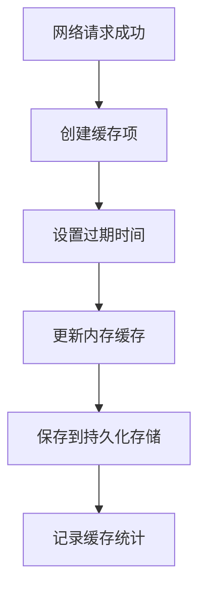
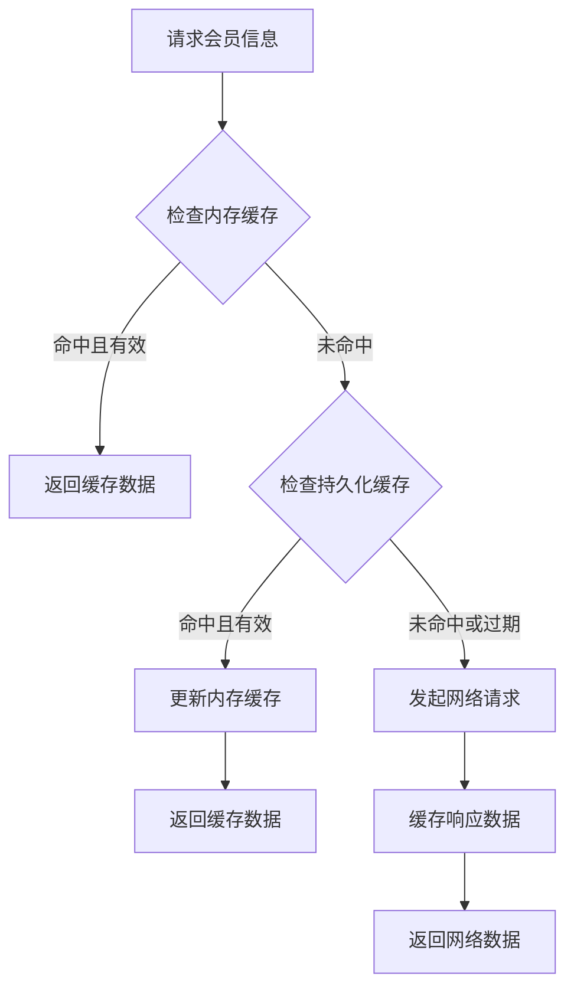
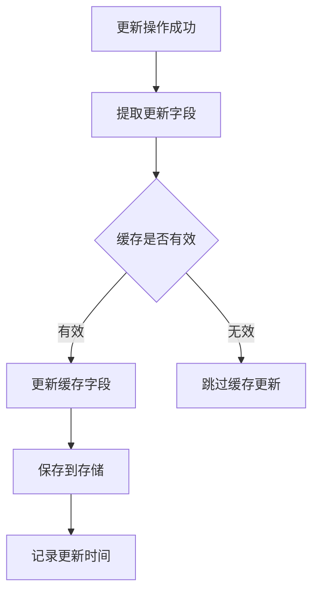

# 会员信息缓存策略

## 📋 概述

会员信息缓存策略旨在减少网络请求，提升用户体验，通过智能的缓存机制确保数据的实时性和一致性。

## 🎯 设计目标

### 核心目标
- **减少网络请求**: 优先从缓存获取数据，降低网络依赖
- **提升响应速度**: 缓存命中时实现毫秒级响应
- **保证数据一致性**: 更新操作后自动同步缓存
- **智能过期管理**: 基于TTL的自动过期机制
- **统计监控**: 提供缓存命中率等关键指标

## 🏗️ 架构设计

### 缓存层次结构

```
┌─────────────────────────────────────┐
│            UI Layer                 │
│        (MemberController)           │
├─────────────────────────────────────┤
│          Service Layer              │
│        (MemberService)              │
├─────────────────────────────────────┤
│          Cache Layer                │
│     (MemberCacheService)            │
├─────────────────────────────────────┤
│         Storage Layer               │
│  Memory Cache + Persistent Storage  │
└─────────────────────────────────────┘
```

### 缓存策略

#### 1. 混合缓存策略
- **内存缓存**: 快速访问，应用生命周期内有效
- **持久化缓存**: 跨应用启动保持，基于SharedPreferences

#### 2. 缓存更新策略
- **写入时更新**: 更新操作成功后立即更新缓存
- **强制刷新**: 支持绕过缓存强制从网络获取
- **智能预热**: 应用启动时预加载缓存

## 🚀 使用方式

### 1. 基本使用

```dart
// 获取会员信息（优先从缓存）
final result = await memberService.getMemberInfo();

// 强制从网络刷新
final result = await memberService.getMemberInfo(forceRefresh: true);

// 更新昵称（自动更新缓存）
await memberService.updateNickName('新昵称');
```

### 2. 缓存管理

```dart
// 获取缓存统计
final stats = memberService.getCacheStats();
print('缓存命中率: ${stats['hitRate']}%');

// 清除缓存
await memberService.clearMemberInfoCache();

// 预热缓存
await memberService.preloadCache();
```

### 3. 控制器集成

```dart
class MemberController extends BaseController with ValidationMixin {
  @override
  void onInit() {
    super.onInit();
    // 自动初始化缓存并预热
    _initializeAndLoadMemberInfo();
  }
  
  Future<void> loadMemberInfo() async {
    // 优先从缓存加载，缓存未命中时自动从网络获取
    final result = await _memberService.getMemberInfo();
    // ...
  }
}
```

## 📊 缓存配置

### 默认配置

```dart
class MemberConfig {
  /// 缓存过期时间（分钟）
  static const int cacheExpirationMinutes = 30;
  
  /// 缓存预热时间（分钟）
  static const int cachePreloadMinutes = 5;
  
  /// 最大缓存大小（字节）
  static const int maxCacheSize = 1024 * 1024; // 1MB
}
```

### 自定义配置

```dart
// 自定义缓存TTL
await cacheService.cacheMemberInfo(
  memberInfo, 
  ttl: Duration(hours: 2),
);

// 刷新缓存过期时间
await cacheService.refreshCache(
  newTtl: Duration(minutes: 60),
);
```

## 🔄 缓存生命周期

### 1. 缓存写入流程



### 2. 缓存读取流程



### 3. 缓存更新流程



## 📈 性能优化

### 1. 缓存命中率优化

- **预热策略**: 应用启动时预加载常用数据
- **TTL调优**: 根据数据更新频率调整过期时间
- **智能刷新**: 后台定期检查数据是否需要更新

### 2. 内存使用优化

- **大小限制**: 设置最大缓存大小防止内存溢出
- **LRU策略**: 最近最少使用的数据优先清理
- **压缩存储**: 对大型数据进行压缩存储

### 3. 网络请求优化

- **批量更新**: 支持批量更新多个字段
- **增量同步**: 只同步变更的字段
- **请求合并**: 短时间内的重复请求进行合并

## 🔍 监控与调试

### 1. 缓存统计指标

```dart
final stats = memberService.getCacheStats();
print('''
缓存统计:
- 命中次数: ${stats['hitCount']}
- 未命中次数: ${stats['missCount']}
- 网络请求次数: ${stats['networkRequestCount']}
- 命中率: ${stats['hitRate']}%
- 缓存年龄: ${stats['cacheAge']}分钟
- 剩余时间: ${stats['remainingTime']}分钟
''');
```

### 2. 调试模式

```dart
// 启用调试模式
const bool debugCache = true;

if (debugCache) {
  print('✅ 缓存命中: ${memberInfo.displayName}');
  print('❌ 缓存未命中，发起网络请求');
  print('💾 缓存已更新: ${cacheItem}');
}
```

### 3. 缓存健康检查

```dart
// 检查缓存是否健康
bool isCacheHealthy() {
  final stats = getCacheStats();
  final hitRate = double.parse(stats['hitRate']);
  
  // 命中率低于50%认为不健康
  return hitRate >= 50.0;
}
```

## ⚠️ 注意事项

### 1. 数据一致性

- **及时更新**: 更新操作后立即同步缓存
- **版本控制**: 考虑添加数据版本号防止冲突
- **冲突处理**: 网络数据与缓存数据冲突时的处理策略

### 2. 错误处理

- **缓存失效**: 缓存损坏时自动降级到网络请求
- **存储异常**: 持久化存储失败时的降级策略
- **网络异常**: 网络不可用时优雅降级到缓存数据

### 3. 安全考虑

- **敏感数据**: 避免缓存敏感信息如密码等
- **数据加密**: 考虑对缓存数据进行加密存储
- **权限控制**: 确保缓存数据的访问权限控制

## 🔮 未来扩展

### 1. 高级功能

- **分布式缓存**: 支持多设备间的缓存同步
- **智能预测**: 基于用户行为预测并预加载数据
- **A/B测试**: 支持不同缓存策略的A/B测试

### 2. 性能优化

- **压缩算法**: 使用更高效的压缩算法
- **索引优化**: 建立缓存索引提升查询效率
- **并发控制**: 优化并发访问的性能

### 3. 监控增强

- **实时监控**: 实时监控缓存性能指标
- **告警机制**: 缓存异常时的自动告警
- **性能分析**: 详细的性能分析和优化建议
